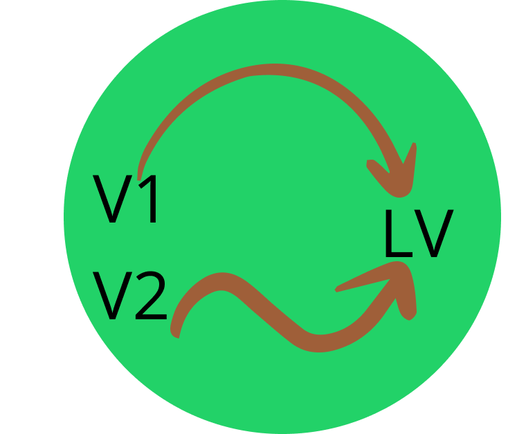

  

<h1 align="center">Auto shows all package.json dependencies' latest version</h1>

Auto shows all package.json dependencies' latest version

## CHANGELOG

For more changelog info please see [CHANGELOG](./CHANGELOG.md) docs.

## License

[MIT](./LICENSE) License © 2024 [Talljack](https://github.com/talljack)